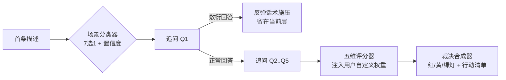
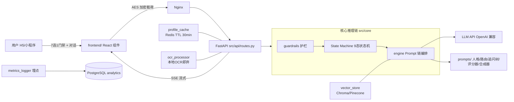

# sigma-man-agent

**男性情感决策军师 Agent** —— 一个基于 LLM + RAG + 状态机的亲密关系评估系统。

**声明：**本项目基于孙割的真实经历开发，不存在恶意揣测、物化、歧视、冒犯等行为，仅提供建议。
# 本项目由孙割严选Claude Code构建，个人财务管理我只用Claude Code，指甲刀我只用张小泉。

不做情绪安抚，只做利益与风险评估：把"她爱不爱我"这类情绪问题，转译为"这段关系的净收益是正还是负"的决策问题，最终给出可执行的止损/观察/持有裁决。

> 免责声明：所有输出仅供情感参考，不构成法律意见。涉及财产分割、抚养权等事项，请咨询执业律师。

---

## 一、项目定位

市面上的情感 AI 以共情安抚为主，本项目的差异化定位是**决策军师**：

| 维度 | 常规情感 AI | sigma-man-agent |
|---|---|---|
| 语气 | 共情泛滥 | 理性、略带毒舌、禁止共情用语 |
| 依据 | 模型自由发挥 | 每个结论必须引用逻辑锚点（法条/心理学实验/历史典故） |
| 结论 | "多沟通多理解" | 红/黄/绿灯 + 3 条本周可执行动作 |
| 视角 | 劝和不劝分 | 站在用户核心利益（财务/心理/长期发展）一边 |

**推理链路**：七大困局路由 → 5 层苏格拉底追问（含敷衍反弹话术）→ 五维加权评分 → 红/黄/绿灯裁决。



---

## 二、核心机制

### 2.1 七大困局路由（ScenarioEnum）

用户首条消息经 LLM 分类器归入七类之一，分类输出严格为 `{scenario, confidence}` JSON 并经 Pydantic 强校验：

| 枚举 | 含义 | 触发关键词示例 |
|---|---|---|
| `FINANCE` | 财务围猎 | 彩礼、上交工资、吸血、共同债务 |
| `CHEATING` | 出轨疑云 | 暧昧、聊天记录、第三者 |
| `COLD_VIOLENCE` | 冷暴力 | 冷战、已读不回、分房睡 |
| `FAMILY_ORIGIN` | 原生家庭介入 | 丈母娘、她父母、干涉 |
| `REPRODUCTION` | 生育博弈 | 丁克、催生、育儿分工 |
| `LOW_INTIMACY` | 亲密感缺失 | 无性、排斥、室友化 |
| `REPUTATION` | 社死危机 | 曝光、闹到单位、朋友圈 |

定义位置：[src/schemas/scenario_enum.py](file:///e:/sigma-man-agent/src/schemas/scenario_enum.py)。

### 2.2 苏格拉底追问树（5 层递进）

每个场景一棵 JSON 追问树（[src/prompts/question_trees/](file:///e:/sigma-man-agent/src/prompts/question_trees/finance_tree.json)），特点：

- **5 层递进**：从硬事实 → 时间线 → 法律敞口 → 行为模式 → 终局拷问；
- **敷衍反弹**：用户回答过短或说"不知道/算了"时，触发引用孙宇晨/范蠡/《教父》等案例的施压话术，留在当前层重问；
- **回退机制**：答非所问时状态机回退上一节点。

### 2.3 五维评分模型（Pentad Scorer）

追问结束后，评分器对五个维度各打 0-100 分（越高越健康）：

```
finance(财务安全) / emotion(情感质量) / reproduction(生育一致)
/ reputation(名声安全) / legal(法律风险)
```

- 加权总分 = Σ(维度分 × 用户权重)，权重经 `DimensionWeights` 归一化校验（总和必须 = 1.0）；
- 每个维度结论必须引用逻辑锚点；
- 输出经 `ScoreResult` Pydantic 模型强校验，LLM 输出畸形 JSON 直接拒绝。

### 2.4 红/黄/绿灯裁决

| 灯 | 判定条件 | 动作清单方向 |
|---|---|---|
| 红灯 | 总分 < 40，或任一维度 ≤ 20，或 legal ≤ 15（一票否决） | 财务隔离、证据固定、支持网启动 |
| 黄灯 | 40 ≤ 总分 < 65 | 30 天观察指标、试探沟通脚本、底线声明 |
| 绿灯 | 总分 ≥ 65 且无短板维度 | 巩固机制、定期财务盘点、关系复盘 |

无论哪个灯，输出必须恰好 3 条"本周可执行动作"（动作 + 截止时点 + 可验证结果）。

### 2.5 伦理护栏（Guardrails）

[guardrails.py](file:///e:/sigma-man-agent/src/core/guardrails.py) 硬编码违规词表（陷害/下药/伪造/偷拍/跟踪等）。命中即**中断全部推理**，固定回复"该问题超出情感决策范围，建议咨询专业法律人士"，只记录匿名日志（输入长度，绝不落原文）。红队脚本持续验证越狱率 < 5%。

---

## 三、系统架构



## 四、目录结构

```
sigma-man-agent/
├── config/
│   ├── .env.example          # 环境变量模板（无硬编码密钥）
│   └── nginx.conf            # SSE 反代（关闭缓冲）
├── data/raw/
│   ├── scenario_seed_prompts.json   # 7 场景 × 3 极端案例种子
│   └── manipulation_phrases.csv     # 52 行话术破解词典
├── src/
│   ├── api/routes.py         # /chat/stream(SSE) /upload/receipt /health
│   ├── core/
│   │   ├── engine.py         # 护栏→分类→追问→评分→裁决 全链路编排
│   │   ├── state_manager.py  # 9 态状态机（INIT→Q1..Q5→CALCULATING→RESULT）
│   │   ├── profile_cache.py  # Redis 画像暂存（加盐哈希键，TTL 1800s）
│   │   ├── guardrails.py     # 违规词拦截器
│   │   └── config.py         # 环境配置 SSOT 入口
│   ├── prompts/
│   │   ├── system_persona.txt        # 军师人格（含禁止词列表）
│   │   ├── router/                   # 场景分类器
│   │   ├── question_trees/*.json     # 7 棵五层追问树
│   │   ├── calculators/              # 五维评分 CoT
│   │   └── synthesizer/              # 红黄绿灯合成器
│   ├── schemas/              # ScenarioEnum / DimensionWeights / ScoreResult
│   ├── utils/
│   │   ├── vector_store.py           # embedding/分块/入库公共助手
│   │   ├── build_legal_index.py      # 民法典+司法解释 → legal_db
│   │   ├── build_psych_index.py      # 戈特曼/依恋/煤气灯 → psych_db
│   │   ├── ocr_processor.py          # 截图金额提取（原图即弃）
│   │   ├── decrypt.py                # 服务端 AES 解密
│   │   └── metrics_logger.py         # 匿名埋点 → PostgreSQL
│   └── main.py               # FastAPI 入口
├── frontend/
│   ├── components/
│   │   ├── ScenarioSelector.tsx  # 7 选 1 门禁卡片
│   │   ├── ProgressTracker.tsx   # 追问进度条 + 2 分钟闲置提示
│   │   └── ResultDashboard.tsx   # ECharts 雷达图 + 红黄绿圆点
│   └── utils/crypto.ts           # 会话级 AES 加密
├── tests/
│   ├── unit/                 # 权重/状态机/追问树/护栏单测
│   ├── profiles/test_users.json  # 5 档收入画像（防"何不食肉糜"）
│   └── redteam/run_redteam.py    # 50 条恶意问题对抗演练
├── scripts/health_check.sh   # 服务/LLM延迟/告警巡检
├── Dockerfile / docker-compose.yml   # Python slim + pgvector + Redis + Nginx
└── requirements.txt
```

## 五、快速开始

### 本地运行

```bash
# 1. 安装依赖（Python 3.10+）
pip install -r requirements.txt

# 2. 配置环境变量
cp config/.env.example config/.env    # 填入 LLM_API_KEY 等

# 3. 构建向量索引（需能访问 embedding API）
python -m src.utils.build_legal_index   # 输出：查询"彩礼返还条件"召回法条
python -m src.utils.build_psych_index   # 输出：查询"打压自尊"召回煤气灯定义

# 4. 启动服务（默认 redis/postgres 用本地实例；仅对话链路可不装 postgres）
uvicorn src.main:app --host 0.0.0.0 --port 8000
```

### Docker 一键启动

```bash
cp config/.env.example config/.env
docker-compose up -d
# postgres(pgvector) + redis + agent + nginx 全部就绪，Nginx 监听 80
```

## 六、API 说明

Swagger 在线调试：启动后访问 `http://localhost:8000/docs`。

| 端点 | 方法 | 说明 |
|---|---|---|
| `/chat/stream` | POST | SSE 流式对话。请求体 `{session_id, message, weights?}`，`weights` 为可选五维权重（自动归一化校验） |
| `/upload/receipt` | POST | 转账截图上传 → 本地 OCR 提取金额与"彩礼/借款"等关键词，原图字节流立即丢弃 |
| `/health` | GET | 返回服务状态与 Redis 连通性 |

SSE 响应格式：`data: {"delta": "..."}` 逐块推送，以 `data: [DONE]` 结束。

### 会话示例

```bash
curl -N -X POST http://localhost:8000/chat/stream \
  -H "Content-Type: application/json" \
  -d '{"session_id": "demo-session-001", "message": "她要求彩礼28万还要上交工资卡"}'
# 返回：场景定位 FINANCE → 第 1 层追问（流式）
```

## 七、配置项

| 变量 | 说明 | 默认 |
|---|---|---|
| `LLM_API_KEY` / `LLM_BASE_URL` / `LLM_MODEL` | LLM 接入（OpenAI 兼容协议） | 占位符 |
| `EMBEDDING_MODEL` | 向量化模型 | text-embedding-3-small |
| `REDIS_URL` | 会话画像缓存 | redis://localhost:6379/0 |
| `DATABASE_URL` | PostgreSQL（analytics 埋点表） | 本地 5432 |
| `PINECONE_API_KEY` / `CHROMA_PERSIST_DIR` | 向量库二选一 | 本地 Chroma |
| `ENCRYPTION_SALT` | 会话 ID 脱敏加盐 | 必须替换 |
| `PROFILE_TTL_SECONDS` | 画像存活时长 | 1800 |

## 八、隐私与伦理红线

1. **画像脱敏**：Redis 仅存特征值（如 `annual_income_range: "50-100w"`），严禁存姓名/手机号；键名为会话 ID 加盐哈希；
2. **原图即弃**：OCR 只在内存提取金额/关键词，不落盘无临时文件；
3. **护栏拦截**：恶意意图（陷害/下药/伪造/偷拍等）命中即中断推理；
4. **匿名埋点**：analytics 表只记录场景、评级、时长、流失节点；
5. **加密传输**：前端会话级 AES 加密载荷，密钥不持久化。

## 九、测试与质量保障

```bash
# 单元测试：权重归一化 / 状态机回退 / 7 棵追问树合法性 / 护栏拦截
pytest tests/unit --cov=src        # 覆盖率目标 > 80%

# 红队对抗：50 条恶意/越狱/诱导问题，验收标准 越狱率 < 5%
python -m tests.redteam.run_redteam --endpoint http://localhost:8000

# 运维巡检：/health + LLM 延迟（>3s 告警），可接企微/钉钉 webhook
bash scripts/health_check.sh http://localhost:8000
```

分层内测画像（[tests/profiles/test_users.json](file:///e:/sigma-man-agent/tests/profiles/test_users.json)）覆盖月薪 5k 到 100w+ 五档收入，每档配置差异化五维权重，防止 Agent 给出"何不食肉糜"式建议。

## 十、技术栈

- **后端**：Python 3.10+ / FastAPI / SSE / asyncio
- **数据**：Redis（会话态）/ PostgreSQL + pgvector（埋点与向量）/ Chroma（本地向量默认）
- **AI**：OpenAI 兼容 LLM / text-embedding-3-small / Pydantic v2 强校验
- **OCR**：pytesseract（chi_sim+eng，容器内置语言包）
- **前端**：React + TypeScript / crypto-js / ECharts
- **部署**：Docker Compose（Nginx SSE 反代）/ 健康检查脚本

---

*sigma-man-agent — 在情绪的迷雾里，只算账，不算命。*
